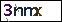

## 基于CNN的强智教务验证码识别

本项目为之前一个[项目](https://github.com/Mundanity-fc/NJUST_Toolkit)的拓展工程。原先项目的验证码识别采用了OpenCV进行处理。为了学习CNN的搭建与使用，于是以这个项目为蓝本进行设计。

强智教务系统验证码的典型形式如下：

放大图片后，发现其除浅灰色干扰线外，还有噪点与黑色边框：

为了识别的准确性，在处理完黑框的基础上，可以对图像进行二值化处理，确定判断的阈值，即可成功对图片进行预处理工作。

#### ImageProcess类

该类包含三个成员函数

> byte2jpeg——将request包所返回的二进制图像转换成Pillow可读取的格式
>
> image_binarize——将Pillow读取的图片进行二值化处理
>
> process——直接将request返回的二进制图像转换成Pillow格式并进行二值化处理

#### ModelClass类

ModelClass类中包含了8个类成员函数。

to_matrix——将标签转换为矩阵

get_max——获取矩阵中最大值

to_string——将矩阵转换为标签

init_train_data——加载训练集

init_test_data——加载测试集

start_train——模型训练

predict_validation——以本地文件预测

predict——以指定输入预测

### Panel类

Panel类为GUI界面类。其中定义了图形界面的功能调用与布局设计。

### ScheduleClass类

ScheduleClass类为与教务处网站的HTTP通信类。其中代码由[先前的项目](https://github.com/Mundanity-fc/NJUST_Toolkit)改写而来。

### 附加内容

Plugin文件夹内包含了部署在树莓派上的QQ机器人插件以及模型的调用代码，适用于Nonebot。
